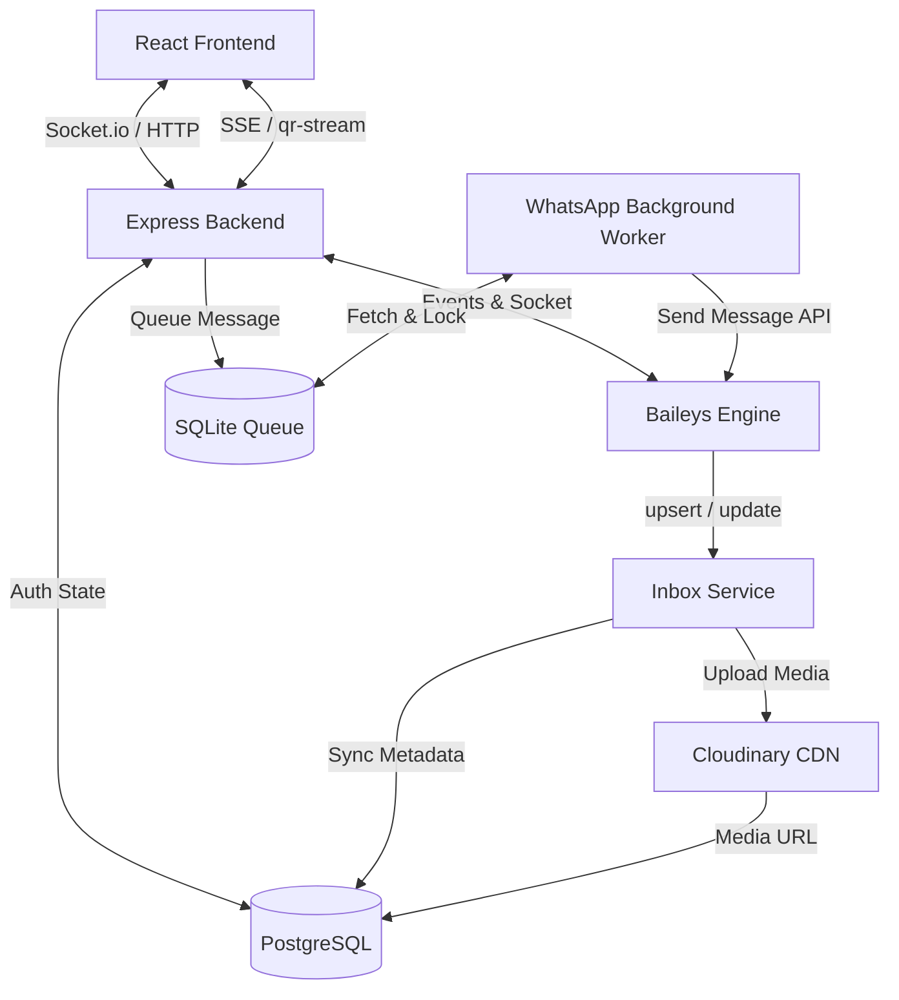

# Baileys WhatsApp Integration: Technical Reference Guide

This document serves as a comprehensive technical reference for implementing a robust, production-grade WhatsApp integration using **Baileys** (`@whiskeysockets/baileys`). It is designed to be a complete blueprint for developers and AI agents to replicate this system in other projects.

---

## 1. Architectural Overview

The integration uses a decoupled, persistent, and event-driven architecture to solve the typical challenges of containerized WhatsApp deployments (e.g., session logouts on redeploy, ephemeral media, and rate-limiting).



### Key Pillars
1. **Database-Backed Session Persistence**: Credentials and signal keys are serialized and stored in PostgreSQL (`whatsapp_sessions`). This prevents logout cycles when deploying to serverless/containerized platforms (like Render or Heroku) that discard local disk state.
2. **Database-Backed Inbox (Single Source of Truth)**: Instead of relying on Baileys' in-memory store (which resets on socket reconnect), all chats, messages, and contacts are mirrored to PostgreSQL.
3. **Lazy Media Offloading**: Binary media files (images, audio, video, documents, stickers) are extracted from WhatsApp, decrypted, and uploaded to Cloudinary. The URLs are stored in PostgreSQL.
4. **SQLite-Backed Background Worker Queue**: WhatsApp messages generated by the app (welcome messages, invoices, prescriptions, recall reminders) are queued in a local SQLite database and processed sequentially with rate-limiting and exponential backoff.
5. **Real-time Synchronization**: QR code generation is streamed to the client via Server-Sent Events (SSE), and inbox messages are synchronized via a secure, admin-only Socket.io namespace.

---

## 2. Database Schema (PostgreSQL)

Run these migrations to set up the persistence layer. Note the inclusion of indexes to support fast pagination of messages and searching of chats.

```sql
-- 1. Session state storage (keeps connection active across deployments)
CREATE TABLE IF NOT EXISTS whatsapp_sessions (
    id TEXT PRIMARY KEY,                       -- Session identifier (e.g. 'default-session')
    data TEXT NOT NULL,                        -- Serialized credentials and signal keys
    created_at TIMESTAMP WITH TIME ZONE DEFAULT CURRENT_TIMESTAMP,
    updated_at TIMESTAMP WITH TIME ZONE DEFAULT CURRENT_TIMESTAMP
);

-- 2. Chat metadata
CREATE TABLE IF NOT EXISTS whatsapp_chats (
    jid TEXT PRIMARY KEY,                      -- Chat JID (e.g. '919000000000@s.whatsapp.net' or '120363@g.us')
    name TEXT,                                 -- Custom contact name or group name
    is_group BOOLEAN DEFAULT FALSE,
    avatar_url TEXT,                           -- Cloudinary URL of contact profile
    last_message_preview TEXT,
    last_message_at TIMESTAMP WITH TIME ZONE,
    unread_count INT DEFAULT 0,
    participant_count INT,
    updated_at TIMESTAMP WITH TIME ZONE DEFAULT NOW()
);

-- 3. Contact book sync
CREATE TABLE IF NOT EXISTS whatsapp_contacts (
    jid TEXT PRIMARY KEY,
    name TEXT,                                 -- Saved contact name
    push_name TEXT,                            -- WhatsApp push name (fallback)
    avatar_url TEXT
);

-- 4. Messages log & content
CREATE TABLE IF NOT EXISTS whatsapp_messages (
    id TEXT PRIMARY KEY,                       -- Baileys message key.id
    chat_jid TEXT REFERENCES whatsapp_chats(jid) ON DELETE CASCADE,
    sender_jid TEXT,
    from_me BOOLEAN,
    body TEXT,                                 -- Message body (text or caption)
    message_type TEXT,                         -- text | image | video | audio | document | sticker
    media_url TEXT,                            -- Cloudinary CDN URL for attachments
    status TEXT,                               -- sent | delivered | read
    timestamp TIMESTAMP WITH TIME ZONE,
    raw JSONB                                  -- Full original Baileys message payload
);

-- 5. Outbound log (for application audit trials)
CREATE TABLE IF NOT EXISTS whatsapp_message_log (
    id SERIAL PRIMARY KEY,
    phone TEXT,
    action TEXT NOT NULL,                      -- e.g. 'send_prescription', 'send_invoice'
    message TEXT,
    status TEXT NOT NULL DEFAULT 'sent',       -- sent | failed
    error TEXT,
    patient_id TEXT,
    patient_name TEXT,
    created_at TIMESTAMP WITH TIME ZONE DEFAULT CURRENT_TIMESTAMP
);

-- Indexes for performance
CREATE INDEX IF NOT EXISTS idx_wa_messages_chat_ts ON whatsapp_messages (chat_jid, timestamp DESC);
CREATE INDEX IF NOT EXISTS idx_wa_log_created ON whatsapp_message_log (created_at DESC);
```

---

## 3. Custom PostgreSQL Auth State (`whatsapp.auth.js`)

To prevent database bloat from an unbounded number of signal keys (which Baileys generates aggressively), we implement a key-value store mapping credentials to database rows, featuring **LRU key pruning** capped at **500 rows** of keys.

```javascript
import { proto } from '@whiskeysockets/baileys';
import { BufferJSON, initAuthCreds } from '@whiskeysockets/baileys';
import { dbService } from '../../core/db/db.service.js';

/**
 * Custom auth state builder utilizing PostgreSQL for multi-instance persistence.
 * @param {string} sessionId Unique ID for the session.
 */
export async function usePostgresAuthState(sessionId = 'default-session') {
  // Read database row
  const readData = async (key) => {
    try {
      const res = await dbService.query(
        'SELECT data FROM whatsapp_sessions WHERE id = $1',
        [`${sessionId}:${key}`]
      );
      if (res.rows[0]) {
        return JSON.parse(res.rows[0].data, BufferJSON.reviver);
      }
    } catch (err) {
      console.error(`[WA Auth] Failed to read key ${key}:`, err.message);
    }
    return null;
  };

  // Write database row
  const writeData = async (key, value) => {
    try {
      const serialized = JSON.stringify(value, BufferJSON.replacer);
      await dbService.query(
        `INSERT INTO whatsapp_sessions (id, data, updated_at) 
         VALUES ($1, $2, NOW()) 
         ON CONFLICT (id) DO UPDATE SET data = EXCLUDED.data, updated_at = NOW()`,
        [`${sessionId}:${key}`, serialized]
      );
    } catch (err) {
      console.error(`[WA Auth] Failed to write key ${key}:`, err.message);
    }
  };

  // Delete database row
  const removeData = async (key) => {
    try {
      await dbService.query('DELETE FROM whatsapp_sessions WHERE id = $1', [
        `${sessionId}:${key}`,
      ]);
    } catch (err) {
      console.error(`[WA Auth] Failed to delete key ${key}:`, err.message);
    }
  };

  // Load existing credentials or initialize defaults
  let creds = await readData('creds');
  if (!creds) {
    creds = initAuthCreds();
    await writeData('creds', creds);
  }

  // Pruning logic to prevent table bloat
  const pruneKeys = async () => {
    try {
      // Keep creds and limit keys to the 500 most recently updated rows
      const prefix = `${sessionId}:`;
      const res = await dbService.query(
        `SELECT id FROM whatsapp_sessions 
         WHERE id LIKE $1 AND id != $2
         ORDER BY updated_at DESC OFFSET 500`,
        [`${prefix}%`, `${prefix}creds`]
      );
      if (res.rows.length > 0) {
        const idsToDelete = res.rows.map((r) => r.id);
        await dbService.query(
          'DELETE FROM whatsapp_sessions WHERE id = ANY($1)',
          [idsToDelete]
        );
        console.log(`[WA Auth] Pruned ${idsToDelete.length} stale signal keys.`);
      }
    } catch (err) {
      console.error('[WA Auth] Key pruning error:', err.message);
    }
  };

  return {
    state: {
      creds,
      keys: {
        get: async (type, ids) => {
          const data = {};
          await Promise.all(
            ids.map(async (id) => {
              let value = await readData(`${type}-${id}`);
              if (type === 'app-state-sync-key' && value) {
                value = proto.Message.AppStateSyncKeyData.fromObject(value);
              }
              data[id] = value;
            })
          );
          return data;
        },
        set: async (data) => {
          const tasks = [];
          for (const category in data) {
            for (const id in data[category]) {
              const value = data[category][id];
              const key = `${category}-${id}`;
              if (value) {
                tasks.push(writeData(key, value));
              } else {
                tasks.push(removeData(key));
              }
            }
          }
          await Promise.all(tasks);
          // Async trigger pruning
          pruneKeys().catch((e) => console.error(e));
        },
      },
    },
    saveCreds: async () => {
      await writeData('creds', creds);
    },
  };
}

/** Check if a valid session exists on server startup */
export async function hasPostgresAuthState(sessionId = 'default-session') {
  try {
    const res = await dbService.query(
      'SELECT 1 FROM whatsapp_sessions WHERE id = $1',
      [`${sessionId}:creds`]
    );
    return res.rows.length > 0;
  } catch {
    return false;
  }
}
```

---

## 4. Connection Lifecycle & QR Streaming via Server-Sent Events

This module establishes the Baileys connection and exposes a Server-Sent Events (SSE) stream `/api/whatsapp/qr-stream`. It broadcasts the connection status and QR code base64 payload to frontend clients dynamically.

```javascript
// backend/src/modules/whatsapp/whatsapp.service.js
import makeWASocket, { DisconnectReason, useMultiFileAuthState } from '@whiskeysockets/baileys';
import qrcode from 'qrcode';
import { usePostgresAuthState } from './whatsapp.auth.js';
import { emitWhatsApp, WA_EVENTS } from '../../shared/sockets/socket.service.js';
import { handleWhatsAppEvents } from './whatsapp.inbox.service.js';

let sock = null;
let connectionStatus = 'disconnected'; // disconnected | awaiting_qr | connecting | connected
let qrCodeData = null;                 // base64 DataURL
const statusListeners = new Set();     // SSE active connections

export const getWASocket = () => sock;
export const getWhatsAppStatus = () => ({ status: connectionStatus, qr: qrCodeData });

export const addStatusListener = (res) => {
  statusListeners.add(res);
  // Send current status immediately
  res.write(`data: ${JSON.stringify(getWhatsAppStatus())}\n\n`);
};

export const removeStatusListener = (res) => {
  statusListeners.delete(res);
};

const broadcastStatus = () => {
  const data = JSON.stringify(getWhatsAppStatus());
  for (const client of statusListeners) {
    client.write(`data: ${data}\n\n`);
  }
};

export async function initWhatsApp() {
  if (sock) return sock;
  
  console.log('[WhatsApp] Initializing Baileys Socket...');
  connectionStatus = 'connecting';
  broadcastStatus();

  const { state, saveCreds } = await usePostgresAuthState('default-session');

  sock = makeWASocket.default({
    auth: state,
    printQRInTerminal: true,
    // Lower priority on containerized deploys with limited memory
    browser: ['Siara Dental', 'Chrome', '1.0.0'],
    defaultQueryTimeoutMs: 60000,
    connectTimeoutMs: 60000,
  });

  sock.ev.on('creds.update', saveCreds);

  sock.ev.on('connection.update', async (update) => {
    const { connection, lastDisconnect, qr } = update;

    if (qr) {
      connectionStatus = 'awaiting_qr';
      try {
        qrCodeData = await qrcode.toDataURL(qr);
      } catch (err) {
        console.error('[WhatsApp] Failed to generate QR base64:', err);
      }
      broadcastStatus();
    }

    if (connection === 'connecting') {
      connectionStatus = 'connecting';
      broadcastStatus();
    }

    if (connection === 'open') {
      connectionStatus = 'connected';
      qrCodeData = null;
      broadcastStatus();
      console.log('[WhatsApp] Socket opened successfully!');
    }

    if (connection === 'close') {
      const shouldReconnect = lastDisconnect?.error?.output?.statusCode !== DisconnectReason.loggedOut;
      console.log(`[WhatsApp] Connection closed. Reason: ${lastDisconnect?.error?.message}. Reconnecting: ${shouldReconnect}`);
      
      sock = null;
      connectionStatus = 'disconnected';
      qrCodeData = null;
      broadcastStatus();

      if (shouldReconnect) {
        setTimeout(() => initWhatsApp(), 5000);
      } else {
        // Clean up database auth rows on logout
        const sessionId = 'default-session';
        await dbService.query('DELETE FROM whatsapp_sessions WHERE id LIKE $1', [`${sessionId}:%`]);
        console.log('[WhatsApp] Session cleared from database due to logout.');
      }
    }
  });

  // Attach event handlers for inbox persistence
  handleWhatsAppEvents(sock);

  return sock;
}

export async function disconnectWhatsApp() {
  if (sock) {
    sock.logout();
    sock = null;
  }
  connectionStatus = 'disconnected';
  qrCodeData = null;
  broadcastStatus();
}
```

### Server-Sent Events Route Configuration (`whatsapp.routes.js`)
To securely stream the QR code to administrative users, establish the route with proper event headers:

```javascript
router.get('/qr-stream', (req, res) => {
  // Set headers to keep HTTP connection alive for SSE
  res.writeHead(200, {
    'Content-Type': 'text/event-stream',
    'Cache-Control': 'no-cache',
    'Connection': 'keep-alive',
  });

  addStatusListener(res);

  req.on('close', () => {
    removeStatusListener(res);
    res.end();
  });
});
```

---

## 5. Inbox Persistence Service (`whatsapp.inbox.service.js`)

This service mirrors active/incoming messages, chat threads, and contacts into PostgreSQL. 

### Lazy Media Offloading to Cloudinary
When an image, video, sticker, document, or audio is received, the binary buffer is fetched using Baileys' `downloadMediaMessage`, uploaded to Cloudinary, and the local database points to the Cloudinary URL. This ensures file persistence even after redeploying or cleaning up the container.

```javascript
import { downloadMediaMessage } from '@whiskeysockets/baileys';
import { dbService } from '../../core/db/db.service.js';
import { uploadToCloudinary } from '../../core/config/cloudinary.js';
import { emitWhatsApp, WA_EVENTS } from '../../shared/sockets/socket.service.js';

// Entry point for Baileys events
export function handleWhatsAppEvents(socket) {
  socket.ev.on('messaging-history.set', async (history) => {
    console.log('[WA Sync] Processing initial history sync...');
    for (const chat of history.chats) {
      await upsertChat(chat);
    }
    for (const msg of history.messages) {
      await upsertMessage(msg, true); // true = sync mode (skip Cloudinary to avoid rate-limits)
    }
    for (const contact of history.contacts) {
      await upsertContact(contact);
    }
    emitWhatsApp(WA_EVENTS.CHAT_UPDATE, { historySync: true });
  });

  socket.ev.on('chats.upsert', async (chats) => {
    for (const chat of chats) await upsertChat(chat);
  });

  socket.ev.on('chats.update', async (updates) => {
    for (const update of updates) {
      await updateChatMetadata(update);
    }
  });

  socket.ev.on('messages.upsert', async (upsert) => {
    // type: 'notify' represents live incoming/outgoing messages
    if (upsert.type === 'notify') {
      for (const msg of upsert.messages) {
        await upsertMessage(msg, false); // false = live upload media
      }
    }
  });
}

// Persist Chat Thread Metadata
async function upsertChat(chat) {
  await dbService.query(
    `INSERT INTO whatsapp_chats (jid, name, unread_count, updated_at)
     VALUES ($1, $2, $3, NOW())
     ON CONFLICT (jid) DO UPDATE SET
       name = COALESCE(EXCLUDED.name, whatsapp_chats.name),
       unread_count = COALESCE(EXCLUDED.unread_count, whatsapp_chats.unread_count),
       updated_at = NOW()`,
    [chat.id, chat.name || null, chat.unreadCount || 0]
  );
}

// Media Downloader and Offloader
async function offloadMediaToCloudinary(message) {
  try {
    const buffer = await downloadMediaMessage(
      message,
      'buffer',
      {},
      {
        logger: console,
        rekey: true,
      }
    );

    const messageType = getMessageType(message);
    const folder = `whatsapp/${messageType}s`;
    
    // Upload binary stream to Cloudinary
    const cloudinaryResponse = await uploadToCloudinary(buffer, folder, messageType);
    return cloudinaryResponse.secure_url;
  } catch (err) {
    console.error('[WA Inbox] Cloudinary upload failed:', err.message);
    return null;
  }
}

// Unpack & Persist Message
async function upsertMessage(msg, isSyncMode = false) {
  const key = msg.key;
  if (!key.id) return;

  const chatJid = key.remoteJid;
  const fromMe = key.fromMe ?? false;
  const senderJid = key.participant || (fromMe ? 'me' : chatJid);
  const timestamp = new Date((msg.messageTimestamp || Date.now() / 1000) * 1000);

  // Parse message content
  const content = msg.message;
  if (!content) return;

  const messageType = getMessageType(msg);
  let body = extractTextBody(content);
  let mediaUrl = null;

  // Offload media if it is a media message
  if (messageType !== 'text' && !isSyncMode) {
    mediaUrl = await offloadMediaToCloudinary(msg);
  }

  // Save to DB
  await dbService.query(
    `INSERT INTO whatsapp_messages (id, chat_jid, sender_jid, from_me, body, message_type, media_url, status, timestamp, raw)
     VALUES ($1, $2, $3, $4, $5, $6, $7, $8, $9, $10)
     ON CONFLICT (id) DO UPDATE SET
       status = EXCLUDED.status,
       media_url = COALESCE(EXCLUDED.media_url, whatsapp_messages.media_url)`,
    [
      key.id,
      chatJid,
      senderJid,
      fromMe,
      body,
      messageType,
      mediaUrl,
      getMessageStatus(msg),
      timestamp,
      JSON.stringify(msg),
    ]
  );

  // Update last message pointer in chat
  await dbService.query(
    `UPDATE whatsapp_chats 
     SET last_message_preview = $1, last_message_at = $2 
     WHERE jid = $3`,
    [body || `[${messageType}]`, timestamp, chatJid]
  );

  // Notify frontend live via Socket
  emitWhatsApp(WA_EVENTS.NEW_MESSAGE, {
    message: {
      id: key.id,
      chatJid,
      senderJid,
      fromMe,
      body,
      type: messageType,
      mediaUrl,
      status: getMessageStatus(msg),
      timestamp: timestamp.getTime(),
    },
    chat: { jid: chatJid, preview: body || `[${messageType}]`, lastMessageAt: timestamp.getTime() },
  });
}

function getMessageType(msg) {
  const content = msg.message;
  if (!content) return 'text';
  const keys = Object.keys(content);
  if (keys.includes('conversation') || keys.includes('extendedTextMessage')) return 'text';
  if (keys.includes('imageMessage')) return 'image';
  if (keys.includes('videoMessage')) return 'video';
  if (keys.includes('audioMessage')) return 'audio';
  if (keys.includes('documentMessage') || keys.includes('documentWithCaptionMessage')) return 'document';
  if (keys.includes('stickerMessage')) return 'sticker';
  return 'text';
}

function extractTextBody(content) {
  if (content.conversation) return content.conversation;
  if (content.extendedTextMessage?.text) return content.extendedTextMessage.text;
  if (content.imageMessage?.caption) return content.imageMessage.caption;
  if (content.videoMessage?.caption) return content.videoMessage.caption;
  if (content.documentMessage?.caption) return content.documentMessage.caption;
  if (content.documentWithCaptionMessage?.message?.documentMessage?.caption) {
    return content.documentWithCaptionMessage.message.documentMessage.caption;
  }
  return '';
}

function getMessageStatus(msg) {
  if (msg.status === 4) return 'read';
  if (msg.status === 3) return 'delivered';
  if (msg.status === 2) return 'sent';
  return 'sent';
}
```

---

## 6. SQLite Background Worker Queue (`sqliteQueue.service.js`)

To prevent blocking the event loop and to comply with WhatsApp's rate-limiting, outbound system messages (automated templates) must pass through a SQLite-backed FIFO queue.

```javascript
import Database from 'better-sqlite3';
import path from 'path';
import fs from 'fs';

const DB_DIR = path.join(process.cwd(), 'data');
const DB_PATH = path.join(DB_DIR, 'queue.sqlite');

class SqliteQueue {
  constructor() {
    if (!fs.existsSync(DB_DIR)) fs.mkdirSync(DB_DIR, { recursive: true });
    this.db = new Database(DB_PATH);
    this.init();
  }

  init() {
    this.db.exec(`
      CREATE TABLE IF NOT EXISTS queues (
        id INTEGER PRIMARY KEY AUTOINCREMENT,
        type TEXT NOT NULL,                  -- Queue type: 'whatsapp'
        action TEXT NOT NULL,                -- e.g. 'send_message'
        payload TEXT,                        -- JSON string of message parameters
        status TEXT NOT NULL DEFAULT 'pending',
        attempts INTEGER NOT NULL DEFAULT 0,
        last_error TEXT,
        dedup_key TEXT,                      -- Unique lock to prevent duplicate sends
        run_at INTEGER,                      -- Delay scheduled run (epoch ms)
        created_at INTEGER NOT NULL,
        updated_at INTEGER NOT NULL
      );
      CREATE INDEX IF NOT EXISTS idx_queues_type_status_runat 
      ON queues(type, status, run_at, created_at);
    `);
  }

  enqueue(type, action, payload = {}, opts = {}) {
    const now = Date.now();
    const runAt = opts.runAt || now;
    const dedupKey = opts.dedupKey || null;

    if (dedupKey) {
      // Prevent enqueuing if a pending job with the same key exists
      const exists = this.db
        .prepare("SELECT id FROM queues WHERE dedup_key = ? AND status = 'pending'")
        .get(dedupKey);
      if (exists) return exists.id;
    }

    const stmt = this.db.prepare(
      `INSERT INTO queues (type, action, payload, dedup_key, run_at, created_at, updated_at) 
       VALUES (?, ?, ?, ?, ?, ?, ?)`
    );
    const info = stmt.run(type, action, JSON.stringify(payload), dedupKey, runAt, now, now);
    return info.lastInsertRowid;
  }

  fetchNext(type) {
    const now = Date.now();
    const select = this.db.prepare(
      `SELECT * FROM queues 
       WHERE type = ? AND status = 'pending' AND run_at <= ? 
       ORDER BY run_at, created_at LIMIT 1`
    );
    const row = select.get(type, now);
    if (!row) return null;

    // Transition status to in_progress to lock it
    this.db.prepare("UPDATE queues SET status = 'in_progress', updated_at = ? WHERE id = ?")
      .run(now, row.id);

    return { ...row, payload: JSON.parse(row.payload || '{}') };
  }

  markDone(id) {
    this.db.prepare("UPDATE queues SET status = 'done', updated_at = ? WHERE id = ?")
      .run(Date.now(), id);
  }

  markFailed(id, errorMsg) {
    this.db.prepare(
      `UPDATE queues 
       SET status = 'failed', attempts = attempts + 1, last_error = ?, updated_at = ? 
       WHERE id = ?`
    ).run(String(errorMsg || ''), Date.now(), id);
  }

  requeue(id, delayMs = 0, errorMsg = null) {
    const runAt = Date.now() + Math.max(0, delayMs);
    this.db.prepare(
      `UPDATE queues 
       SET status = 'pending', last_error = ?, updated_at = ?, run_at = ? 
       WHERE id = ?`
    ).run(String(errorMsg || ''), Date.now(), runAt, id);
  }
}

export const sqliteQueue = new SqliteQueue();
```

### Background Processing Loop (`whatsapp-worker.js`)
The worker runs at a controlled interval, pulling locked jobs from the SQLite queue, applying exponential backoff delays on failure, and maintaining a cooldown period of **3.5 seconds** between successful messages to respect carrier spam thresholds.

```javascript
import { sqliteQueue } from '../../shared/queue/sqliteQueue.service.js';
import { getWASocket } from './whatsapp.service.js';
import { dbService } from '../../core/db/db.service.js';

let running = false;
let timeoutId = null;
const COOLDOWN_MS = 3500; // Rate-limiting delay

export function startWhatsAppWorker() {
  if (running) return;
  running = true;
  console.log('👷 WhatsApp Background Worker started.');
  loop();
}

export function stopWhatsAppWorker() {
  running = false;
  if (timeoutId) clearTimeout(timeoutId);
  console.log('👷 WhatsApp Background Worker stopped.');
}

async function loop() {
  if (!running) return;

  try {
    const job = sqliteQueue.fetchNext('whatsapp');
    if (!job) {
      // Nothing to process, poll again in 2 seconds
      timeoutId = setTimeout(loop, 2000);
      return;
    }

    const socket = getWASocket();
    if (!socket) {
      // Socket not ready, return job to pending state with a 5s delay
      sqliteQueue.requeue(job.id, 5000, 'WhatsApp socket disconnected');
      timeoutId = setTimeout(loop, 5000);
      return;
    }

    await processJob(job, socket);
  } catch (err) {
    console.error('[WA Worker] Loop error:', err.message);
    timeoutId = setTimeout(loop, 5000);
  }
}

async function processJob(job, socket) {
  const { phone, text, options } = job.payload;
  const formattedJid = `${phone.replace(/[^0-9]/g, '')}@s.whatsapp.net`;

  try {
    console.log(`[WA Worker] Sending message to ${formattedJid}...`);
    
    // Execute Baileys Socket Send
    const sent = await socket.sendMessage(formattedJid, { text }, options);
    
    // Log outbound status
    await dbService.query(
      `INSERT INTO whatsapp_message_log (phone, action, message, status, patient_id)
       VALUES ($1, $2, $3, 'sent', $4)`,
      [phone, job.action, text, job.payload.patientId || null]
    );

    sqliteQueue.markDone(job.id);
    console.log(`[WA Worker] Job ${job.id} sent successfully.`);

    // Cooldown pause before next loop iteration to prevent spam blocks
    timeoutId = setTimeout(loop, COOLDOWN_MS);
  } catch (err) {
    console.error(`[WA Worker] Failed to send job ${job.id}:`, err.message);
    
    const isRetryable = job.attempts < 3;
    if (isRetryable) {
      // Exponential backoff: 30s, 60s, 120s...
      const backoffDelay = Math.pow(2, job.attempts) * 30000;
      sqliteQueue.requeue(job.id, backoffDelay, err.message);
      console.log(`[WA Worker] Job ${job.id} requeued with backoff.`);
    } else {
      sqliteQueue.markFailed(job.id, err.message);
      await dbService.query(
        `INSERT INTO whatsapp_message_log (phone, action, message, status, error, patient_id)
         VALUES ($1, $2, $3, 'failed', $4, $5)`,
        [phone, job.action, text, err.message, job.payload.patientId || null]
      );
    }
    
    timeoutId = setTimeout(loop, COOLDOWN_MS);
  }
}
```

---

## 7. Database Cleanup & Pruning

We maintain database hygiene through scheduled deletion of soft-deleted records and system logs.

### Pruning Routine (`cleanup.service.js`)
Triggered via cron (configured in `scheduler.service.js`), this function permanently deletes soft-deleted records older than 90 days, removes associated media from Cloudinary to avoid CDN storage costs, and prunes the SQLite queue table of successfully sent log entries older than 7 days.

```javascript
import { dbService } from '../../core/db/db.service.js';
import { deleteFromCloudinary } from '../../core/config/cloudinary.js';
import { sqliteQueue } from '../queue/sqliteQueue.service.js';

export const runStaleDataCleanup = async () => {
  console.log('[Cleanup] Starting stale data cleanup process...');
  const stats = {
    xraysCloudinaryDeleted: 0,
    xraysDbDeleted: 0,
    sqliteLogsDeleted: 0,
  };

  try {
    // 1. Identify stale X-Rays older than 90 days
    const staleXrays = await dbService.query(`
      SELECT id, cloudinary_public_id 
      FROM xrays 
      WHERE is_deleted = TRUE AND created_at < NOW() - INTERVAL '90 days'
    `);

    for (const xray of staleXrays.rows) {
      if (xray.cloudinary_public_id) {
        try {
          await deleteFromCloudinary(xray.cloudinary_public_id, 'image');
          stats.xraysCloudinaryDeleted++;
        } catch (err) {
          console.error('[Cleanup] Failed to delete Cloudinary asset:', err.message);
        }
      }
      await dbService.query('DELETE FROM xrays WHERE id = $1', [xray.id]);
      stats.xraysDbDeleted++;
    }

    // 2. Prune SQLite queue logs older than 7 days
    const sqliteDb = sqliteQueue.getDb();
    const sevenDaysAgo = Date.now() - 7 * 24 * 60 * 60 * 1000;
    
    // Prune completed (done) and failed jobs
    const pruneStmt = sqliteDb.prepare("DELETE FROM queues WHERE status IN ('done', 'failed') AND created_at < ?");
    const pruneInfo = pruneStmt.run(sevenDaysAgo);
    stats.sqliteLogsDeleted = pruneInfo.changes;

    console.log('[Cleanup] System cleanup completed:', stats);
    return stats;
  } catch (error) {
    console.error('[Cleanup] Stale data cleanup failed:', error);
    throw error;
  }
};
```

---

## 8. Real-time Frontend Cache Sync

The React client utilizes a dedicated hook to intercept Socket.io events and stream them directly into the TanStack Query cache. This approach eliminates the need to maintain duplicate state or execute heavy page refetches when receiving new messages.

### The Realtime hook (`useWhatsappRealtime.ts`)
```typescript
import { useEffect, useRef } from 'react';
import { useQueryClient } from '@tanstack/react-query';
import { useSocket } from '@/shared/contexts/SocketContext';
import { WaNewMessageEvent, WaMessageStatusEvent } from '../types';
import { CHATS_KEY, appendMessageToThread, applyNewMessageToChats, applyMessageStatus } from '../lib/cache';

export function useWhatsappRealtime(activeJid: string | null) {
  const { socket } = useSocket();
  const queryClient = useQueryClient();
  const activeJidRef = useRef(activeJid);

  useEffect(() => {
    activeJidRef.current = activeJid;
  }, [activeJid]);

  useEffect(() => {
    if (!socket) return;

    const token = localStorage.getItem('smartcare_token');
    
    // Subscribe admin client to private WhatsApp room
    const subscribe = () => socket.emit('whatsapp:subscribe', token);
    subscribe();
    socket.on('connect', subscribe);

    // Event: Live Message Received
    socket.on('whatsapp:new-message', (evt: WaNewMessageEvent) => {
      const { message, chat } = evt;
      
      // Update sidebar preview
      applyNewMessageToChats(queryClient, chat, activeJidRef.current);
      
      // Prepend to active chat pane if JID matches
      if (message.chatJid === activeJidRef.current) {
        appendMessageToThread(queryClient, message.chatJid, message);
      }
    });

    // Event: Message Status Update (sent -> delivered -> read)
    socket.on('whatsapp:message-status', (evt: WaMessageStatusEvent) => {
      applyMessageStatus(queryClient, evt.chatJid, evt.id, evt.status);
    });

    return () => {
      socket.off('connect', subscribe);
      socket.off('whatsapp:new-message');
      socket.off('whatsapp:message-status');
      socket.emit('whatsapp:unsubscribe');
    };
  }, [socket, queryClient]);
}
```

### Cache Mutators (`cache.ts`)
```typescript
import { QueryClient, InfiniteData } from '@tanstack/react-query';
import { WaChat, WaMessage } from '../types';

export const CHATS_KEY = ['wa-chats'] as const;
export const messagesKey = (jid: string) => ['wa-messages', jid] as const;

type MessagePages = InfiniteData<WaMessage[], number | undefined>;

// Mutates sidebar chat preview list
export function applyNewMessageToChats(qc: QueryClient, chat: WaChat | null, activeJid: string | null) {
  if (!chat) return;
  qc.setQueryData<WaChat[]>(CHATS_KEY, (prev) => {
    const list = prev ? [...prev] : [];
    const idx = list.findIndex((c) => c.jid === chat.jid);
    
    const merged: WaChat = idx >= 0
      ? { ...list[idx], ...chat, name: chat.name ?? list[idx].name, avatarUrl: chat.avatarUrl ?? list[idx].avatarUrl }
      : chat;

    if (idx >= 0) list[idx] = merged; else list.push(merged);
    return [...list].sort((a, b) => (b.lastMessageAt ?? 0) - (a.lastMessageAt ?? 0));
  });
}

// Intercepts and appends to the infinite list thread cache
export function appendMessageToThread(qc: QueryClient, jid: string, msg: WaMessage) {
  qc.setQueryData<MessagePages>(messagesKey(jid), (prev) => {
    if (!prev) return { pages: [[msg]], pageParams: [undefined] };
    
    // If message already exists (e.g. from server confirmation), override status
    let found = false;
    const pages = prev.pages.map((page) =>
      page.map((m) => {
        if (m.id === msg.id) { found = true; return msg; }
        return m;
      })
    );
    if (found) return { ...prev, pages };

    // Reconcile optimistic temp message (remove temp placeholder and use real message)
    const firstPage = pages[0] ? [...pages[0]] : [];
    const cleaned = msg.fromMe
      ? firstPage.filter((m) => !(m.id.startsWith('temp-') && m.fromMe && m.body === msg.body))
      : firstPage;
      
    pages[0] = [msg, ...cleaned];
    return { ...prev, pages };
  });
}

// Updates ticks (single/double/blue)
export function applyMessageStatus(qc: QueryClient, chatJid: string, id: string, status: WaMessage['status']) {
  qc.setQueryData<MessagePages>(messagesKey(chatJid), (prev) => {
    if (!prev) return prev;
    const pages = prev.pages.map((page) =>
      page.map((m) => (m.id === id ? { ...m, status: status ?? m.status } : m))
    );
    return { ...prev, pages };
  });
}
```

---

## 9. QR Code Scanning & EventSource Setup

To connect to WhatsApp from the browser, we use SSE (`EventSource`) to receive status and QR updates in real-time.

```typescript
// frontend/src/modules/settings/Settings.tsx
const startQrStream = () => {
  const token = localStorage.getItem('smartcare_token');
  const apiBaseUrl = import.meta.env.VITE_API_BASE_URL || "http://localhost:3001";
  
  // Connect SSE with authentication token as query parameter
  const es = new EventSource(`${apiBaseUrl}/api/whatsapp/qr-stream?token=${token}`);

  es.onmessage = (event) => {
    const data = JSON.parse(event.data);
    setWaStatus(data); // { status: 'awaiting_qr' | 'connected', qr: 'data:image/png;base64,...' }

    if (data.status === 'connected') {
      es.close();
      setIsWaModalOpen(false);
      toast.success('WhatsApp connected successfully!');
    }
  };

  es.onerror = () => {
    es.close();
  };

  return es;
};
```
